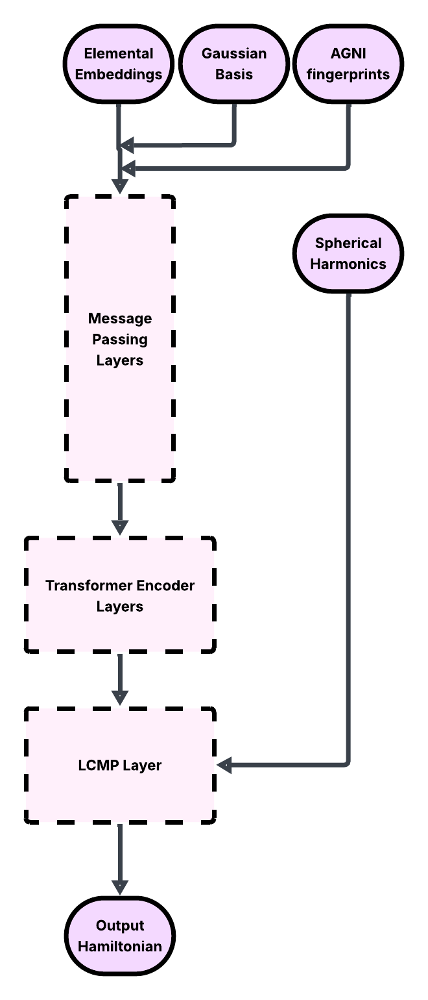

# QuantumDescent - Modified framework for deep learning representation of density functional theory Hamiltonian

For a detailed description, refer to the [report](project-report.pdf)

## Architecure


## How to run?
```
pip install .
cd deeph
deeph-train --config ./default.ini
```

